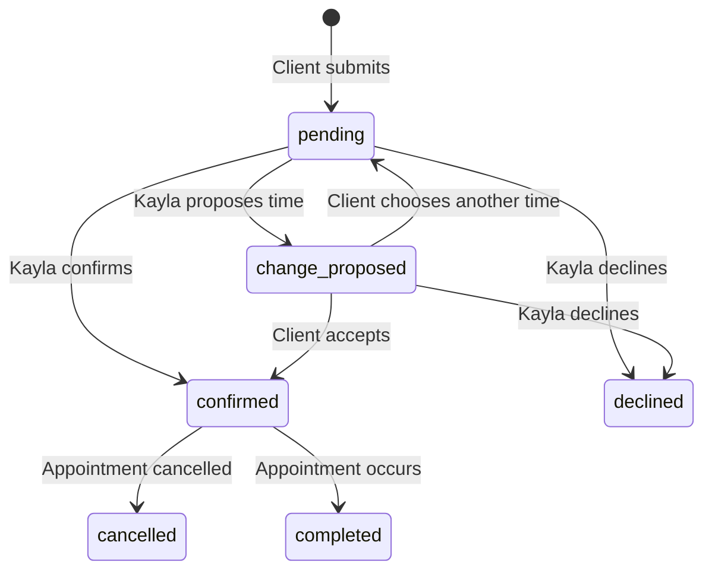

# Style With Kayla — D1 Schema and API Contract

Status: architecture milestone for review  
Prepared: July 13, 2026  
Source of truth: the approved Booking & Style Profile Master Plan and current interactive prototype

## 1. Scope

This document defines the database and server API contract for the first functional implementation. It deliberately separates the core booking and approval system from Microsoft Graph so the website can launch in manual-approval mode before a calendar account is connected.

The schema is implemented in `db/schema.ts`. The API routes below are the contract for the next implementation phase; they are not all live yet.

## 2. Non-negotiable invariants

1. A booking begins as `pending`; public submission never confirms an appointment.
2. `requested_start_at` and `confirmed_start_at` are separate. The original request is never overwritten.
3. Event date and appointment date are separate.
4. A pending or proposed booking owns an active database hold until Kayla confirms, declines, releases, or replaces it.
5. The server checks all overlapping active holds before creating or moving a hold. Client-side availability is advisory only.
6. Only a confirmed booking can receive a Style Profile.
7. Private URLs contain high-entropy random tokens. D1 stores only a SHA-256 hash, never the raw token.
8. A submitted Style Profile is client-read-only until an authenticated admin deliberately reopens it.
9. Every booking status change and every submitted-profile correction or reopening is recorded.
10. Profile answers use stable keys and values in JSON. Display wording may change without rewriting historical answers.
11. Outlook is the authority for busy/free status once connected. The website remains the authority for booking, client, profile, and communication state.
12. Outlook credentials are encrypted secrets outside D1. D1 stores only account/calendar identifiers and a reference to the secret.

## 3. Time and identifier conventions

- API date-times: RFC 3339 UTC strings, for example `2026-07-18T16:30:00.000Z`.
- D1 date-times: Unix epoch milliseconds stored as integers.
- Local scheduling timezone: `America/Boise`.
- Event dates: calendar dates in `YYYY-MM-DD`; they are not converted to UTC.
- Primary keys: server-generated UUID v4 strings.
- Public booking references: short, non-secret display identifiers such as `SWK-7K4M9P`.
- Public booking references never authorize access.
- Raw private tokens: at least 32 cryptographically random bytes, base64url encoded.

## 4. Tables and ownership

| Table | Purpose |
|---|---|
| `clients` | Deduplicated client contact record and retention clock |
| `services` | Six public service definitions, durations, and routing modes |
| `booking_settings` | Timezone, 24-hour notice, 60-day horizon, overdue threshold, and calendar-check toggle |
| `availability_rules` | Recurring Tuesday–Saturday morning and afternoon windows |
| `availability_overrides` | One-off available or unavailable periods entered by Kayla |
| `bookings` | Current booking state plus distinct requested, proposed, and confirmed times |
| `booking_holds` | Current and historical requested/proposed/confirmed slot holds |
| `booking_status_history` | Append-only booking state audit trail |
| `style_profiles` | One profile snapshot per booking with flexible JSON answers |
| `style_profile_revisions` | Append-only profile save, submission, correction, and reopening snapshots |
| `private_access_tokens` | Hashed, expiring, revocable profile and alternate-time access tokens |
| `inspiration_assets` | One optional private R2 image per profile and its deletion deadline |
| `calendar_connections` | Configurable Microsoft account/calendar metadata; no OAuth token values |
| `calendar_events` | Link between a confirmed booking and its Outlook event |
| `communications` | Email/SMS/manual communication delivery log |
| `data_requests` | Client access, correction, and deletion requests |

## 5. Seed data

### Services

| Code | Audience | Duration | Routing mode |
|---|---:|---:|---|
| `women_event` | Women | 60 minutes | `womens_event` |
| `women_everyday` | Women | 90 minutes | `age` |
| `women_closet` | Women | 180 minutes | `age` |
| `men_event` | Men | 60 minutes | `mens_event` |
| `men_everyday` | Men | 90 minutes | `mens_styling` |
| `men_closet` | Men | 180 minutes | `mens_styling` |

### Routine availability

Use ISO weekday values in application code and store 0–6 using JavaScript weekday numbering in D1:

- Tuesday–Saturday (`2`–`6`): 10:30–13:30, stored as minutes `630`–`810`.
- Tuesday–Saturday (`2`–`6`): 14:30–17:30, stored as minutes `870`–`1050`.
- Monday and Sunday have no recurring rule.

### Settings

- `timezone`: `America/Boise`
- `minimum_notice_minutes`: `1440`
- `booking_horizon_days`: `60`
- `pending_overdue_minutes`: `1440`
- `calendar_conflict_check_enabled`: false until a calendar is authorized

## 6. Booking state machine



“Release hold” is an administrative action, not a separate booking status. Releasing a pending hold leaves the booking pending but makes it unavailable for confirmation until Kayla proposes or assigns another time. The release is recorded in the hold and history metadata.

### Hold rules

- Overlap test: existing `starts_at < candidate_end` and existing `ends_at > candidate_start` for active holds.
- A booking may have many historical holds but no more than one active hold.
- `pending` normally owns a `requested` hold.
- `change_proposed` owns a `proposed` hold.
- `confirmed` owns a `confirmed` hold.
- Decline or cancel releases the active hold.
- Completing an appointment keeps the historical confirmed hold but marks it inactive.
- No hold expires automatically.
- Admin conflict override requires `overrideConflict: true` and an audit reason.

## 7. Profile routing

| Service routing mode | Booking answer | Profile type |
|---|---|---|
| `age` | `under_40` | `under_40` |
| `age` | `40_plus` | `over_40` |
| `age` | `manual_review` | Null until Kayla selects a profile |
| `womens_event` | Any valid event details | `womens_event` |
| `mens_styling` | None | `mens_styling` |
| `mens_event` | Any valid event details | `mens_event` |

The client never sees the internal profile type labels.

## 8. API conventions

Base path: `/api`  
Content type: `application/json` except direct file upload/download responses.

### Success envelope

```json
{
  "data": {},
  "requestId": "uuid"
}
```

### Error envelope

```json
{
  "error": {
    "code": "SLOT_UNAVAILABLE",
    "message": "That appointment time is no longer available.",
    "fieldErrors": {
      "requestedStartAt": "Choose another available time."
    }
  },
  "requestId": "uuid"
}
```

Use these status codes consistently:

- `400` malformed or invalid request
- `401` missing or invalid admin/private token
- `403` authenticated but action not allowed
- `404` resource not found or deliberately concealed
- `409` state or slot conflict
- `410` expired/revoked private link
- `413` inspiration image too large
- `422` valid JSON with field validation failures
- `429` rate limited
- `500` unexpected server failure
- `503` required calendar/provider temporarily unavailable

Mutation endpoints accept an `Idempotency-Key` header. Store the key and result before notification delivery is implemented so client retries cannot create duplicate bookings or confirmations.

## 9. Public booking endpoints

### `GET /api/services`

Returns active services and durations. No authentication.

### `GET /api/availability`

Query:

- `serviceCode` required
- `from` required `YYYY-MM-DD`
- `to` required `YYYY-MM-DD`, limited to the current 60-day horizon

Server behavior:

1. Generate candidates from recurring rules and overrides.
2. Require the entire service duration to fit inside a window.
3. Remove times inside 24 hours.
4. Remove overlapping active database holds.
5. When enabled, remove Outlook busy conflicts.
6. Return an `availabilityMode` value of `routine_only` or `routine_plus_calendar`.

Response:

```json
{
  "data": {
    "timezone": "America/Boise",
    "availabilityMode": "routine_only",
    "slots": [
      {
        "startsAt": "2026-07-18T16:30:00.000Z",
        "endsAt": "2026-07-18T18:00:00.000Z"
      }
    ]
  },
  "requestId": "uuid"
}
```

### `POST /api/bookings`

No authentication. Rate limited by IP plus normalized email. Requires privacy acknowledgement.

Request:

```json
{
  "client": {
    "fullName": "Example Client",
    "email": "client@example.com",
    "phone": "208-555-0100"
  },
  "serviceCode": "women_everyday",
  "requestedStartAt": "2026-07-18T16:30:00.000Z",
  "returningClient": false,
  "howHeard": "Instagram",
  "ageRange": "under_40",
  "eventType": null,
  "eventDate": null,
  "bookingNotes": null,
  "privacy": {
    "policyVersion": "2026-07-13",
    "acknowledged": true
  }
}
```

Transaction/batch behavior:

1. Validate service-specific conditional fields.
2. Recalculate duration and end time on the server.
3. Recheck notice, horizon, routine availability, overrides, holds, and calendar conflicts.
4. Upsert client by normalized email and refresh contact fields.
5. Create booking as `pending` with separate requested time fields.
6. Create active requested hold.
7. Append initial status history.
8. Queue/record the “request received” communication.

Response is `201` and contains only the non-secret public reference and pending summary. It never returns the internal booking ID.

## 10. Private client-action endpoints

Private endpoints receive the raw token in the URL. The server hashes it, looks up an unexpired and unrevoked record with the expected purpose, and uses constant-time comparison where applicable. Responses use `Cache-Control: no-store` and `Referrer-Policy: no-referrer`.

### `GET /api/client-actions/:token`

Returns the proposed time, original request summary, and allowed actions for an `alternate_time` token.

### `POST /api/client-actions/:token/accept-proposed-time`

Requires booking status `change_proposed` and the token’s current booking. Moves proposed fields into confirmed fields, converts the active hold to confirmed, records history, revokes the action token, and creates profile access. Calendar event creation is queued only when calendar sync is enabled.

### `POST /api/client-actions/:token/request-another-time`

Request contains one currently available `requestedStartAt`. Releases the proposed hold, creates a new requested hold, returns the booking to `pending`, preserves all prior requested/proposed values in history, and rotates the action token.

## 11. Private Style Profile endpoints

### `GET /api/style-profile/:token`

Returns:

- Client first name
- Confirmed appointment summary
- Public service name
- Internal schema rendered as client-facing questions
- Existing answers and current section
- Status: `draft`, `submitted`, or `reopened`

Never returns contact details, admin notes, token hashes, audit actor IDs, or other bookings.

### `PUT /api/style-profile/:token/draft`

Request:

```json
{
  "schemaVersion": 1,
  "currentSection": 3,
  "answers": {
    "shopping_for": ["Work", "Everyday"],
    "top_sizes": ["M", "L"],
    "shoe_sizes": ["8", "8.5"]
  },
  "inspirationLink": "https://www.pinterest.com/example/board"
}
```

Behavior:

- Allowed only for `draft` or `reopened`.
- Validates keys and stable values against the stored profile type/schema version.
- Enforces selection limits and required fields at submission, not on every draft save.
- Saves answers and progress without collecting booking contact fields.
- May append a `saved` revision at meaningful checkpoints; it need not append on every keystroke.

### `POST /api/style-profile/:token/submit`

Validates the complete schema, writes a `submitted` revision snapshot, sets `submitted_at` and `locked_at`, and changes status to `submitted`. Repeat calls with the same idempotency key return the original success result.

### `POST /api/style-profile/:token/inspiration-image`

Deferred until R2 is bound. Accepts one private image per profile. Validates allowed image MIME types and size before writing an opaque R2 key. Replacing an image deletes the prior object. The client cannot choose the storage key.

### `DELETE /api/style-profile/:token/inspiration-image`

Allowed only while the profile is editable. Deletes the R2 object and metadata.

## 12. Admin endpoints

Every `/api/admin/*` route requires authenticated admin middleware. Owner-only page visibility is not sufficient authentication. The authentication provider remains configurable; endpoint handlers consume a verified `AdminPrincipal` with an immutable subject ID.

### Read endpoints

- `GET /api/admin/bookings?status=&from=&to=&overdue=&cursor=`
- `GET /api/admin/bookings/:bookingId`
- `GET /api/admin/bookings/:bookingId/history`
- `GET /api/admin/clients/:clientId`
- `GET /api/admin/style-profiles/:profileId/revisions`
- `GET /api/admin/settings/availability`
- `GET /api/admin/calendar/status`

### Booking actions

- `POST /api/admin/bookings/:bookingId/confirm`
  - Requires active requested/proposed hold unless explicit override.
  - Sets confirmed fields and profile route.
  - Creates profile, rotates private profile token, logs history, and queues confirmation.
- `POST /api/admin/bookings/:bookingId/propose-time`
  - Validates new range, releases old hold, creates proposed hold, sets `change_proposed`, and creates an expiring action token.
- `POST /api/admin/bookings/:bookingId/decline`
  - Requires a client-facing reason or approved template key.
  - Releases active hold and records decline.
- `POST /api/admin/bookings/:bookingId/release-hold`
  - Releases the active hold without erasing the request.
- `POST /api/admin/bookings/:bookingId/cancel`
  - Requires confirmed booking, releases hold, updates linked calendar event when enabled, and schedules image deletion for 30 days later.
- `POST /api/admin/bookings/:bookingId/complete`
  - Marks appointment completed, updates client/profile two-year retention dates, and schedules image deletion for 30 days later.

Every action accepts `expectedStatus`. Return `409 BOOKING_STATE_CHANGED` when another action changed the booking first.

### Profile actions

- `POST /api/admin/style-profiles/:profileId/reopen`
  - Requires a reason, sets `reopened`, clears the current lock, rotates access token, and appends a full revision snapshot.
- `PATCH /api/admin/style-profiles/:profileId/answers`
  - Requires a correction reason and changed keys.
  - Appends an `admin_corrected` snapshot; never overwrites history invisibly.
- `POST /api/admin/bookings/:bookingId/select-profile-type`
  - Required for `manual_review` age routing before confirmation/profile delivery.

### Availability/settings actions

- `PUT /api/admin/settings/availability-rules`
- `POST /api/admin/settings/availability-overrides`
- `DELETE /api/admin/settings/availability-overrides/:overrideId`
- `PATCH /api/admin/settings/booking`

Public restrictions remain 24 hours and 60 days. Admin actions may override them only with a recorded reason.

## 13. Calendar integration endpoints — later phase

- `POST /api/admin/calendar/connect`
- `GET /api/admin/calendar/callback`
- `POST /api/admin/calendar/disconnect`
- `POST /api/admin/calendar/reconcile`
- `POST /api/webhooks/microsoft-graph`

Calendar integration requirements:

- Use the minimum permission that supports configured behavior.
- Never expose access/refresh tokens to the browser or store them in D1 plaintext.
- Validate Microsoft webhook client-state secrets.
- Renew expiring subscriptions automatically.
- Reconcile periodically in case notifications are missed.
- Keep Macy’s calendar access disabled unless Macy’s IT explicitly approves it.
- When calendar checks are disabled/unavailable, availability responses clearly report `routine_only`; Kayla verifies the combined Apple Calendar before confirmation.

## 14. Retention jobs

Scheduled server jobs perform these operations:

1. Delete R2 inspiration objects where `delete_after <= now` and mark metadata deleted.
2. Identify clients whose `retention_delete_after <= now` and who have no legal/operational hold or newer booking.
3. Process approved deletion requests and leave a minimal audit record when required.
4. Revoke expired private tokens.
5. Renew Graph subscriptions and reconcile calendar links once calendar integration is enabled.

Completing a new appointment recalculates the client’s written-data deletion deadline to two years after that completion. Cancelling an appointment schedules image deletion but does not incorrectly reset the written-history clock.

## 15. Validation and security baseline

- Normalize email by trim + lowercase; preserve the client’s display form separately.
- Normalize phone for matching but preserve the entered phone string.
- Derive service duration, end time, routing mode, and profile type on the server.
- Reject unexpected JSON keys on sensitive mutation payloads.
- Limit text lengths and normalize line endings.
- Sanitize output and never render client strings as raw HTML.
- Apply CSRF protection to cookie-authenticated admin mutations.
- Apply rate limits to booking creation, token lookups, and upload endpoints.
- Use generic responses for unknown client tokens to reduce enumeration.
- Add `Cache-Control: no-store` to all client/private/admin responses.
- Log request IDs and error codes, not raw profile answers or tokens.
- Do not include secrets, token hashes, private R2 keys, or admin notes in public responses.
- Maintain automated tests for state transitions, overlap races, expiry/revocation, profile locking, and retention dates.

## 16. Implementation order

1. Generate and inspect the D1 migration from `db/schema.ts`.
2. Seed settings, six services, and ten availability windows.
3. Implement shared validation, response envelopes, token hashing, and transaction helpers.
4. Implement services, availability, and booking submission.
5. Implement authenticated admin list/detail and booking actions.
6. Implement secure Style Profile draft/submission/reopening.
7. Add R2 inspiration image support.
8. Add notifications and calendar files.
9. Add Microsoft Graph only after manual approval works end to end.

## 17. Decisions still required before their implementation phase

- Admin authentication provider and recovery method.
- Email/SMS delivery provider and sender identity.
- Maximum inspiration-image size and allowed formats.
- Exact private-link expiration duration and renewal policy.
- Which personal/business Microsoft account and calendar will be connected.

These decisions do not block the D1 schema, booking submission, or manual admin approval implementation.

## Unified Women’s Style Profile Routing

New Women’s Everyday Styling and Women’s Full Closet Refresh bookings use the
`womens_styling` profile type.

Booking-level `age_range` may remain null for these new bookings. Existing
`under_40`, `40_plus`, and `manual_review` booking values remain readable, and
existing `under_40`, `over_40`, `womens_event`, `mens_styling`, and
`mens_event` Style Profiles remain supported.

No D1 migration is required because `profile_type` is stored as text and no
table or column structure changed.
